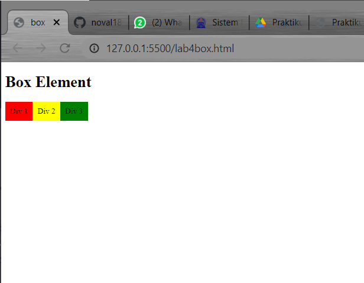

# Praktikum 4: CSS LayOut

<hr>
## Langkah-Langkah Praktikum

### 1. Persiapan membuat dokumen HTML dengan nama lab4_layout.html sebagai berikut.

```html
<!DOCTYPE html>
<html lang="en">
  <head>
    <meta charset="UTF-8" />
    <meta name="viewport" content="width=device-width, initial-scale=1.0" />
    <title>Box Element</title>
  </head>
  <body>
    <header>
      <h1>Box Element</h1>
    </header>
  </body>
</html>
```

### 2. Membuat Box Element

kemudian tambah kode untuk membuat box element dengan tag div seperti berikut

```html
<section>
  <div class="div1">Div 1</div>
  <div class="div2">Div 2</div>
  <div class="div3">Div 3</div>
</section>
```

### 3. CSS Float Property

Selanjutnya deklarasi CSS pada head untuk membuat float element, sepeti berikut.

```css
<style>
  div {
    float: left;
    padding: 10px;
  }
  .div1 {
    background: rgb(224, 28, 28);
  }
  .div2 {
    background: rgb(0, 38, 255);
  }
  .div3 {
    background: rgb(255, 6, 6);
  }
</style>
```

Kemudian buka browser untuk melihat hasilnya



### 4. Mengatur Clearfix Element

<b>Clearfix</b> digunakan untuk mengatur element setelah float property _clear_ digunakan mengaturnya.
<br> Tambahkan element div lainnya setelah div 3 seperti berikut.

```html
<section>
  <div class="div1">Div 1</div>
  <div class="div2">Div 2</div>
  <div class="div3">Div 3</div>
  <div class="div4">Div 4</div>
</section>
```

Kemudian atur property clear pada CSS, seperti berikut

```css
.div4 {
  background-color: rgb(0, 225, 255);
  clear: left;
  float: none;
}
```

Selanjutnya buka browser dan refresh kembali.


Lakukan eksperimen terhadap penggunaan property clear dengan nilai lainnya (left, both, right), dan amati perubahannya

### 5. Membuat LayOut Sederhana

Kita akan membuat layout web sederhana seperti gambar berikut.


Buat <b>folder baru</b> dengan nama <b>lab4_layout</b>, kemudian buatah file baru didalamnya dengan nama <b>home.html</b>, dan file css dengan nama <b>style.css</b>.

```html
<!DOCTYPE html>
<html lang="en">
  <head>
    <meta charset="UTF-8" />
    <meta http-equiv="X-UA-Compatible" content="IE=edge" />
    <meta name="viewport" content="width=device-width, initial-scale=1.0" />
    <title>LayOut Sederhana</title>
    <link rel="stylesheet" href="style.css" />
  </head>
  <body>
    <div id="container"></div>
  </body>
</html>
```

Kemudian buat kernagka layout dengan semantics element seperti berikut.


Kemudian tulis kode berikut.

```html
<!DOCTYPE html>
<html lang="en">
  <head>
    <meta charset="UTF-8" />
    <meta http-equiv="X-UA-Compatible" content="IE=edge" />
    <meta name="viewport" content="width=device-width, initial-scale=1.0" />
    <title>LayOut Sederhana</title>
    <link rel="stylesheet" href="style.css" />
  </head>
  <header>
    <h1>Layout Sederhana</h1>
  </header>
  <body>
    <div id="container">
      <nav>
        <a href="home.html" class="active">Home</a>
        <a href="artikel.html">Artikel</a>
        <a href="about.html">About</a>
        <a href="kontak.html">Kontak</a>
      </nav>
      <section id="hero"></section>
      <section id="wrapper">
        <section id="main"></section>
        <aside id="sidebar"></aside>
      </section>
      <footer>
        <p>&copy; 2021 - Universitas Pelita Bangsa</p>
      </footer>
    </div>
  </body>
</html>
```

Kemudian buka browser dan lihat hasilnya.


Kemudian tambbahkan kode CSS untuk membuat layoutnya.

```css
/*import google font*/
@import url("https://fonts.googleapis.com/css2?family=Open+Sans+Condensed:ital,wght@0,300;0,700;1,300&display=swap");
@import url("https://fonts.googleapis.com/css2?family=Open+Sans:ital,wght@0,300;0,400;0,600;0,700;0,800;1,300;1,400;1,600;1,700;1,800&display=swap");
/* Reset CSS */
* {
  margin: 0;
  padding: 0;
}
body {
  line-height: 1;
  font-size: 100%;
  font-family: "Open Sans", sans-serif;
  color: #5a5a5a;
}
#container {
  width: 980px;
  margin: 0 auto;
  box-shadow: 0 0 1em #cccccc;
} /* header */
header {
  padding: 20px;
}
header h1 {
  margin: 20px 10px;
  color: #b5b5b5;
}
```

kemudian lihat hasilnya


### 6. Membuat Hero Panel

Selanjutnya membuat hero panel. Tambahkan kode HTML dan CSS seperti berikut.

```html
<section id="hero">
  <h1>HELLO WORLD</h1>
  <p>
    Lorem ipsum dolor sit amet, consectetur adipiscing elit. Vestibulum lorem
    elit, iaculis innisl volutpat, malesuada tincidunt arcu. Proin in leo
    fringilla, vestibulum mi porta, faucibus felis. Integer pharetra est nunc,
    nec pretium nunc pretium ac.
  </p>
  <a href="home.html" class="btn btn-large">Learn more &raquo;</a>
</section>
```

<br>

```css
/* Hero Panel */
#hero {
  background-color: #e4e4e5;
  padding: 50px 20px;
  margin-bottom: 20px;
}
#hero h1 {
  margin-bottom: 20px;
  font-size: 35px;
}
#hero p {
  margin-bottom: 20px;
  font-size: 18px;
  line-height: 25px;
}
```


### 7. Mengatur Layout Main dan Sidebar

Selanjutnya mengatur main content dan sidebar, tambahkan CSS float

```css
/* main content */
#wrapper {
  margin: 0;
}
```

<br>

```css
#main {
  float: left;
  width: 640px;
  padding: 20px;
}
/* sidebar area */
#sidebar {
  float: left;
  width: 260px;
  padding: 20px;
}
```

### 8. Membuat Sidebar Widget

Kemudian selanjutnya menambahkan element lain dalam sidebar.

```html
<aside id="sidebar">
  <div class="widget-box">
    <h3 class="title">Widget Header</h3>
    <ul>
      <li><a href="#">Widget Link</a></li>
      <li><a href="#">Widget Link</a></li>
      <li><a href="#">Widget Link</a></li>
      <li><a href="#">Widget Link</a></li>
      <li><a href="#">Widget Link</a></li>
    </ul>
  </div>
  <div class="widget-box">
    <h3 class="title">Widget Text</h3>
    <p>
      Vestibulum lorem elit, iaculis in nisl volutpat, malesuada tincidunt arcu.
      Proin in leo fringilla, vestibulum mi porta, faucibus felis. Integer
      pharetra est nunc, nec pretium nunc pretium ac.
    </p>
  </div>
</aside>
```

Kemudian tambahkan CSS.

```css
/* widget */
.widget-box {
  border: 1px solid #eee;
  margin-bottom: 20px;
}
.widget-box .title {
  padding: 10px 16px;
  background-color: #428bca;
  color: #fff;
}
.widget-box ul {
  list-style-type: none;
}
.widget-box li {
  border-bottom: 1px solid #eee;
}
.widget-box li a {
  padding: 10px 16pz;
  color: 333;
  display: block;
  text-decoration: none;
}
.widget-box li:hover a {
  background-color: #eee;
}
.widget-box p {
  padding: 15px;
  line-height: 25px;
}
```


### 9. Mengatur Footer

Selanjutnya mengatur tampilan footer. Tambahkan CSS footer.

```css
/* footer */
footer {
  clear: both;
  background-color: #1d1d1d;
  padding: 20px;
  color: #eee;
}
```


### 10. Menambahkan Element Lainnya Pada Main Conect

```html
<div class="row">
  <div class="box">
    
    <h3>Heading</h3>
    <p>Donec sed odio dui. Etiam porta sem malesuada magna mollis euismod.</p>
    <a href="#" class="btn btn-default">View detail</a>
  </div>
  <div class="box">
    
    <h3>Heading</h3>
    <p>Donec sed odio dui. Etiam porta sem malesuada magna mollis euismod.</p>
    <a href="#" class="btn btn-default">View detail</a>
  </div>
  <div class="box">
    
    <h3>Heading</h3>
    <p>Donec sed odio dui. Etiam porta sem malesuada magna mollis euismod.</p>
    <a href="#" class="btn btn-default">View detail</a>
  </div>
</div>
```

Kemudian tambahkan CSS

```css
/* box */
.box {
  display: block;
  float: left;
  width: 33.333333%;
  box-sizing: border-box;
  -moz-box-sizing: border-box;
  -webkit-box-sizing: border-box;
  padding: 0 10px;
  text-align: center;
}
.box h3 {
  margin: 15px 0;
}
.box p {
  line-height: 20px;
  font-size: 14px;
  margin-bottom: 15px;
}
box img {
  border: 0;
  vertical-align: middle;
}
.image-circle {
  border-radius: 50%;
}
.row {
  margin: 0 -10px;
  box-sizing: border-box;
  -moz-box-sizing: border-box;
  -webkit-box-sizing: border-box;
}
.row:after,
.row:before,
.entry:after,
.entry:before {
  content: "";
  display: table;
}
.row:after,
.entry:after {
  clear: both;
}
```

Lihat hasilnya dibrowser


### 11. Menambahkan Content Artikel

Selanjutnya membuat content artikel. Tambahkan HTML berikut pada main content.

```html
<hr class="divider" />
<article class="entry">
  <h2>First featurette heading.</h2>
  
  <p>
    Lorem ipsum dolor sit amet, consectetur adipiscing elit. Vestibulum lorem
    elit, iaculis in nisl volutpat, malesuada tincidunt arcu. Proin in leo
    fringilla, vestibulum mi porta, faucibus felis. Integer pharetra est nunc,
    nec pretium nunc pretium ac.
  </p>
</article>
<hr class="divider" />
<article class="entry">
  <h2>First featurette heading.</h2>
  
  <p>
    Lorem ipsum dolor sit amet, consectetur adipiscing elit. Vestibulum lorem
    elit, iaculis in nisl volutpat, malesuada tincidunt arcu. Proin in leo
    fringilla, vestibulum mi porta, faucibus felis. Integer pharetra est nunc,
    nec pretium nunc pretium ac.
  </p>
</article>
```

Kemudian tambahkan CSS.

```css
.divider {
  border: 0;
  border-top: 1px solid #eeeeee;
  margin: 40px 0;
}
  /* entry */
  .entry {
  margin: 15px 0;
  }
  .entry h2 {
  margin-bottom: 20px;
}
.entry p {
  line-height: 25px;
}
.entry img {
  float: left;
  border-radius: 5px;
  margin: 15px;
}
.entry .right-img{
  float: right;
}
```

<hr>

# Pertanyaan dan tugas
<hr>

### 1. Tambahkan Layout untuk menu About
=> buat single layout yang berisi deskripsi, portfolio, dll
### 2. Tambahkan layout untuk menu Contact
=> yang berisi form isian: nama, email, message, dll